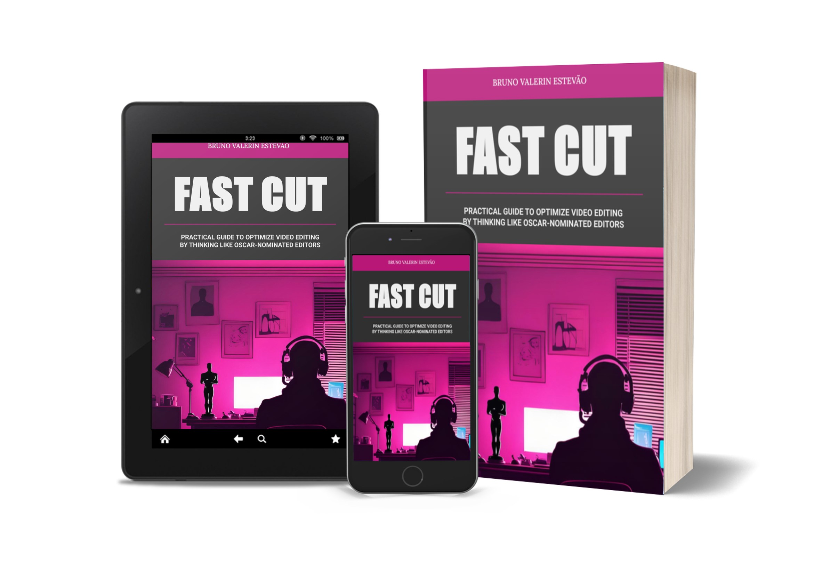

# Project: E-BOOK Generated by AI
[PORTUGUESE VERSION](https://github.com/brunovalerin/ebook-fast-cut-ai/tree/main)

 > NOTE: This repository was developed as a prompt engineering exercise during Caixa's 'Generative AI with Microsoft Copilot' bootcamp on the [DIO](https://dio.me) platform. 

<a href="https://github.com/brunovalerin/ebook-fast-cut-ai/blob/main/output/FAST_CUT_en.pdf" title="View PDF now"> 📕READ THE E-BOOK HERE!</a>

## 💻 Technologies used in the project

- [ChatGPT](https://chatgpt.com/) 
- [RunWay](https://runwayml.com/)
- [Google Slides](https://workspace.google.com/products/slides/)

## 🧠 Prompts

📚 ChatGPT：

|   Action   | Prompt                                                                                            |                           
| :------: | ------------------------------------------------------------------------------------------------- |
|  Title  | Suggest e-book titles on the topic of video editing, with tips to speed up the process. Short and catchy titles |
| Topics | Write a 10-chapter summary for an e-book on the topic: Tips for Speeding Up the Video Editing Process. The e-book should include an introduction and conclusion |
| Content | Use the generated chapters and write the e-book using the following rules: each chapter should have a maximum reading time of 2 minutes. The language should be dynamic and easy to understand, focused on people who already have knowledge in the area. The tips should apply to any editing software. Use analogies and cite examples of films that have been nominated for an Oscar. |
| Closing | Write the last page of the book, keeping the same pattern as the chapters. Follow the RULES and use the items in SYNOPSIS. RULES: Start with a brief thank you to the reader, inform that the content was created using AI, tell the reader to continue studying and look for other ways to delve deeper into the subject. SYNOPSIS: The book was made for educational purposes and prompt engineering experimentation, and the content was reviewed and designed by the author. |

**NOTE:** This is a translation of the prompts originally made in Brazilian Portuguese.. Also, the syntax of the prompts used braces, brackets and other characters that would mess up the formatting of the presentation in question. 

🖼️ RunWay：

|  Action  | Prompt                                                                                 |
| :----: | -------------------------------------------------------------------------------------- |
| Cover | Silhouette of a video editor on computer, oscar statuette on the desk and trophies on the wall, in a bedroom, with motion blur, indirect neon lighting |
| Illustrations_1 | Silhouette of a video editor on computer, oscar statuette on the desk in a bedroom, with motion blur, indirect neon lighting |
| Illustrations_2 | Sideo editor computer desk, with motion blur, indirect neon lighting |

