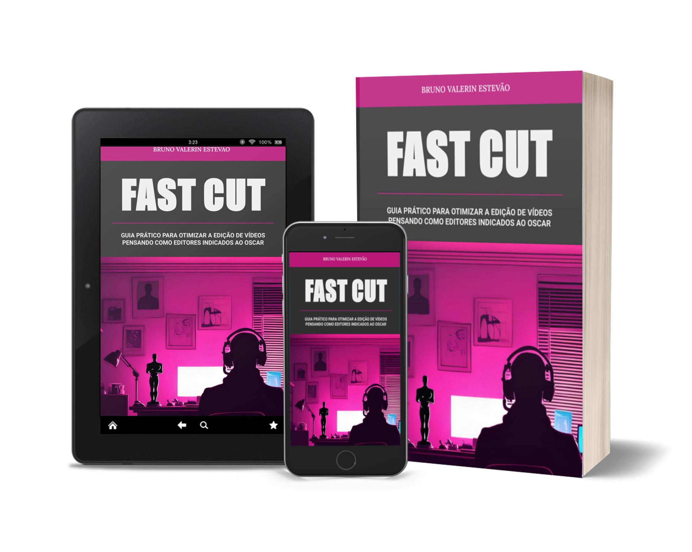

# Projeto EBOOK Gerado por I.A.s

 > ℹ️ NOTE: Este é o repositório desenvolvido como um exercício de engenharia de prompt durante o bootcamp 'IA Generativa com Microsoft Copilot' da Caixa na plataforma da [DIO](https://dio.me)

Projeto com o objetivo de gerar um ebook digital com as facilidades das ferramentas de IA. Todos os prompts
seguem abaixo.

<a href="https://github.com/felipeAguiarCode/prompts-recipe-to-create-a-ebook/blob/main/output/ebook%20-%20css%20jedi%20output.pdf" title="View PDF now"> 📕Clique aqui para ler</a>

## 💻 Tecnologias utilizadas no projeto

- [ChatGPT](https://chat.openai.com/) 
- [MidJourney](https://runwayml.com/)
- [Google Slides](https://workspace.google.com/products/slides/)

## 🧠 Prompts

ChatGPT：

|   Ação   | prompt                                                                                                                                                                                                                                                                         |
| :------: | ------------------------------------------------------------------------------------------------------------------------------------------------------------------------------------------------------------------------------------------------------------------------------ |
|  título  | sugira títulos de e-book sobre o tema edição de vídeos, com dicas para acelerar o processo. títulos curtos e chamativos |                                                     
| tópicos | escreva um sumário com 10 capítulos para um e-book sobre o tema: dicas para acelerar o processo de edição de vídeos. O e-book deve conter dez capítulos, incluindo introdução e conclusão |
| conteúdo | Use  os capítulos gerados e escreva o e-book usando as seguintes regras: 
-cada capítulo deve ter duração de leitura máxima de 2 minutos 
-a linguagem deve ser dinâmica e de fácil compreensão, focada para pessoas que já tem conhecimento na área 
-as dicas devem se aplicar para qualquer software de edição
-use analogias e cite exemplos de filmes que já foram indicados ao oscar |
| encerramento | Escreva ultima página do livro mantendo o mesmo padrão dos capítulos. Siga as {REGRAS} e use os itens em {RESUMO}
{REGRAS}
- Iniciar com breve agradecimento direcionado ao leitor
- Informar que o conteúdo foi feito utilizando IA
- Indicar ao leitor que continue estudando e busque outras formas de se aprofundar no tema
{RESUMO}
O livro foi feito para fins didáticos e experimentação de engenharia de prompt e o conteúdo foi revisado e diagramado pelo autor |

RunWay：

|  Ação  | prompt                                                                                 |
| :----: | -------------------------------------------------------------------------------------- |
| capa | silhouette of a video editor on computer, oscar statuette on the desk and trophies on the wall, in a bedroom, with motion blur, indirect neon lighting |
| ilustrações 1 | silhouette of a video editor on computer, oscar statuette on the desk in a bedroom, with motion blur, indirect neon lighting |
| ilustrações 2 | video editor computer desk, with motion blur, indirect neon lighting |

## ✨ Features

- Conteúdo gerado via ChatGPT
- Imagens geradas via Runway

## 📚 Materiais

- Imagens utilizadas em `assets`
- ebook gerado durante as aulas em `output`

## 🛠️ Instruções de execução

Utilize os prompts acima nas ferramentas sugeridas para gerar o material base e utilize uma ferramenta de edição de documentos como power point, libreoffice , indesign para diagramação.
